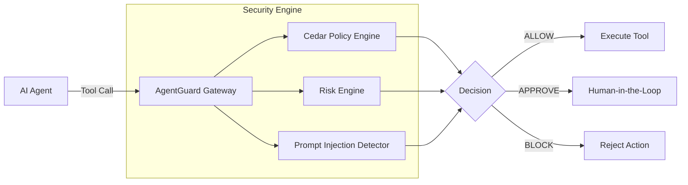

# AgentGuard

**AI can decide what it wants to do. AgentGuard decides what it is allowed to do.**

AgentGuard is a universal runtime security and authorization control plane for AI agents. It acts as an independent security gateway that intercepts AI agent tool invocations, evaluates them against organizational security policies, and blocks malicious, destructive, or unauthorized actions before they execute.

## The Problem
AI agents are increasingly given access to real-world tools (email, databases, filesystems, deployment pipelines). However, AI models are inherently unpredictable and susceptible to prompt injection, hallucination, and adversarial manipulation. 

Relying on the AI to police itself is unsafe. AgentGuard solves this by decoupling authorization from intelligence.

## Live Demo

**Try AgentGuard:** [Live Playground](http://localhost:3000/playground)

```bash
pip install agentguard
```
```python
from agentguard import AgentGuard

guard = AgentGuard(
    agent_id="research-agent",
    server="http://localhost:8000"
)

guard.require(
    "email",
    "send",
    arguments={
        "to": "external@example.com"
    }
)
```
- **ALLOW** → executes
- **APPROVE** → waits for human approval
- **BLOCK** → execution halted

## Architecture



## Security Flow

Every tool invocation passes through AgentGuard and results in one of three outcomes:

- **ALLOW**: The action is safe, authorized, and executes immediately.
- **APPROVE**: The action requires human oversight (e.g., sending an external email). Execution is paused until cryptographically approved.
- **BLOCK**: The action violates policy, exhibits high risk, or contains a prompt injection attack. Execution is denied.

## Features
- **Zero-Trust AI Security**: The AI never holds direct access to the underlying tools.
- **Policy-as-Code**: Powered by AWS Cedar for expressive, verifiable authorization policies.
- **Threat Detection**: Built-in ML and heuristics to detect Prompt Injections and Jailbreaks.
- **Context-Aware Risk Engine**: Dynamic risk scoring based on data sensitivity and execution context.
- **Human-in-the-Loop (HITL)**: JIT approval workflows for sensitive operations.
- **Immutable Audit Trail**: Cryptographically linked hash-chain ledger for all agent activity.
- **Universal Integrations**: MCP Gateway, Python SDK, LangChain, and CrewAI decorators.

## Quickstart

### 1. Docker Setup
The fastest way to run the AgentGuard backend:
```bash
docker-compose up -d
```
The API is now available at `http://localhost:8000`.

### 2. Python SDK

```python
from agentguard import AgentGuard

guard = AgentGuard(agent_id="research-agent", server="http://localhost:8000")

# Request authorization before executing a tool
decision = guard.authorize(
    tool="email",
    action="send",
    arguments={"body": "Hello world!"}
)

if decision.allowed:
    send_email(...)
elif decision.blocked:
    print(f"Action blocked: {decision.reason}")
```

### 3. Python Decorator

```python
from agentguard import AgentGuard

guard = AgentGuard(agent_id="research-agent")

@guard.protect(tool="email", action="send")
def send_email(to, body):
    # This function is now protected by AgentGuard
    pass
```

### 4. Model Context Protocol (MCP) Gateway

AgentGuard acts as a native MCP server that wraps your protected tools:

```json
{
  "mcpServers": {
    "agentguard": {
      "command": "python",
      "args": ["test_mcp_client.py"]
    }
  }
}
```
All MCP tool executions are transparently routed through the AgentGuard security pipeline.

## Project Structure

- `backend/`: FastAPI server, Cedar policies, SQLite db, risk engine, and ML detectors.
- `sdk/python/`: Production Python SDK and framework integrations.
- `cli/`: Textual-based TUI for managing agents, policies, and approvals.
- `docs/`: Threat models, architecture, and deployment guides.

## Security Limitations
AgentGuard provides defense-in-depth, but no system is impenetrable.
- **ML Evasion**: Prompt injection detectors can be bypassed by novel attacks. 
- **Configuration Errors**: Overly permissive Cedar policies negate AgentGuard's protections.
- See the [Threat Model](docs/threat-model.md) for full details.

## Contributing
Please read [CONTRIBUTING.md](CONTRIBUTING.md) for details on our code of conduct and the process for submitting pull requests.

## License
This project is licensed under the MIT License.
